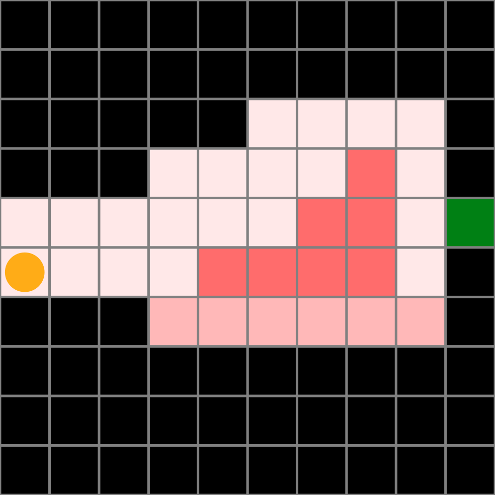

# Readme

This repo contains GeoSteeringMDP and GeosteeringPOMDP problems in Julia. GeoSteering a problem where ...
You can think of this as a modified gridworld problem. 


## MDP example



```julia
using GeoSteerings
using DiscreteValueIteration
using POMDPs
using POMDPSimulators
using Random

gs = GeoSteering()

#offline policy
solver = ValueIterationSolver(max_iterations=1000);
policy = solve(solver, gs)

#simulate
hr = HistoryRecorder(max_steps=100, rng=MersenneTwister(1))
hist = simulate(hr, gs, policy)

#visualize
plot2 = GeoSteerings.render(gs, (s=[1,5],), policy=policy)
savefig(plot2, (10, 10), "figs/GeoSteeringPolicyExample.pdf")
```

## POMDP example

TBA