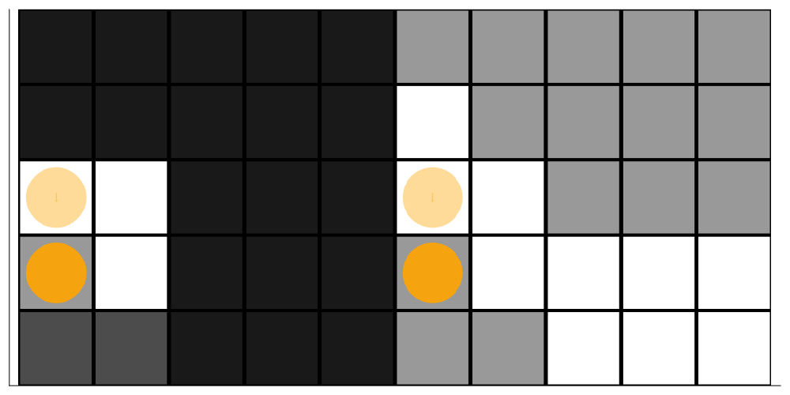

# GeoSteerings.jl

[](https://github.com/mansurarief/GeoSteerings.jl/actions/workflows/CI.yml)
[](https://codecov.io/gh/mansurarief/GeoSteerings.jl)

This repository contains implementations of GeoSteeringMDP and GeoSteeringPOMDP problems in Julia. *GeoSteering* is a process used in the subsurface exploration industry to guide the wellbore of a drilling operation in real-time, ensuring it stays within a predefined target. This complex problem involves making sequential decisions based on uncertain and incomplete information, which can be effectively modeled using Markov Decision Processes (MDP) and Partially Observable Markov Decision Processes (POMDP).

## MDP Example


```julia
using Random
using POMDPs
using POMDPTools
using DiscreteValueIteration
using GeoSteerings

#set the random seed
rng = MersenneTwister(1)

#initialize the MDP with tiny drift_prob
gs = initialize_mdp(
    rng=rng, size=(5, 5), base_amplitude=1.0, 
    base_frequency=1.0, target_thickness=2.0, 
    vertical_shift=3.0, drift_prob=0.001) 

VIsolver = ValueIterationSolver(max_iterations=50);
@time policy = solve(VIsolver, gs)

# simulate the policy
hr = HistoryRecorder(max_steps=10, rng=rng)
@time hist = simulate(hr, gs, policy)

# plot and animate the simulation
plot_sim_steps = GeoSteerings.render(gs, hist);
println(length(hist), " steps in the simulation")
println(length(plot_sim_steps), " plots in the simulation")

# save the plots as a pdfs, pngs, and gif
[GeoSteerings.savefig(plot_sim_steps[i], gs.size, joinpath("figs", "SimRollout$i.pdf")) for i in 1:length(hist)];
[GeoSteerings.savefig(plot_sim_steps[i], gs.size, joinpath("figs", "SimRollout$i.png")) for i in 1:length(hist)];
create_gif_from_images(dir=figs_dir, gif_name="MDPPolicy1_NoDrifting.gif", fps=2, num_steps=length(hist))

```

## POMDP Example



```julia
using ParticleFilters
using POMCPOW
using MCTS
using Random
using POMDPs
using POMDPTools
using GeoSteerings


rng = MersenneTwister(1)
gs = initialize_pomdp(
    rng=rng, size=(5, 5), base_amplitude=1.0, 
    base_frequency=1.0, target_thickness=2.0, 
    vertical_shift=2.0, drift_prob=0.1) #adding some drift_prob

up = BootstrapFilter(gs, 100, rng)
b0 = ParticleCollection(support(initialize_belief(gs)))
s0 = rand(rng, initialstate(gs))

solver = POMCPOWSolver(tree_queries=50,criterion=MaxUCB(100.0))
policy = solve(solver, gs)

hr = HistoryRecorder(max_steps=30, rng=rng)
@time hist_ = simulate(hr, gs, policy, up, b0)

# plot and animate the simulation
plot_sim_steps = GeoSteerings.render(gs, hist_);
plot_sim_full = GeoSteerings.render(gs, hist_, full=true);

[GeoSteerings.savefig(plot_sim_steps[i], gs.size, joinpath("figs", "$base_img_sim$i.png")) for i in 1:length(hist_)];
[GeoSteerings.savefig(plot_sim_full[i], gs.size, joinpath("figs", "$base_img_full$i.png")) for i in 1:length(hist_)];

create_side_by_side_gif_from_images(dir="figs", img1_base="SimRollout", img2_base="FullRollout", 
    gif_name="POMDPPolicy$(policy_num)_WithDrifting.gif", fps=1, num_steps=length(hist_))

```

## Notebooks

Notebook examples are available in [GeoSteeringMDP](https://github.com/mansurarief/GeoSteerings.jl/blob/main/notebooks/GeoSteeringMDP.ipynb) and [GeoSteeringPOMDP](https://github.com/mansurarief/GeoSteerings.jl/blob/main/notebooks/GeoSteeringPOMDP.ipynb).

